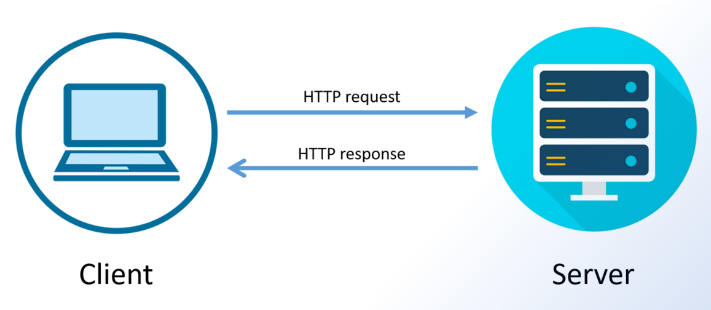

# Pengenalan Pemrograman Web

Pemrograman web adalah proses membuat dan mengembangkan aplikasi berbasis web dengan menggunakan bahasa pemrograman.

---

# Sejarah dan Perkembangan Web

- Pemrograman web dimulai pada awal 1990an bersamaan dengan diciptakannya World Wide Web
- Bahasa yang digunakan pertama untuk pembuatan web adalah HTML yang digunakan untuk membuat halaman web statis
- Kemudian dikembangkan bahasa pemrograman seperti PHP, ASP, JavaScript untuk membuat halaman web dinamis
- Kemajuan teknologi web terus berkembang hingga saat ini dengan munculnya framework dan teknologi baru.

---

# Bahasa Pemrograman Web Populer

- `HTML`, `CSS`, `JavaScript` untuk front-end atau Client-side
- `PHP`, `Ruby`, `Python`, `Java` untuk back-end atau Server-side
- SQL untuk manajemen database seperti `MySQL`, `Postgress`, dan `SQL Server`.
- Banyak framework populer untuk setiap bahasa seperti `React`, `Bootstrap`, `Laravel`, dan lainnya

---

# Perbedaan Front-end dan Back-end

- Front-end berhubungan dengan tampilan dan antarmuka pengguna
- Back-end berhubungan dengan logika program dan akses data
- Front-end menggunakan `HTML`, `CSS`, `JavaScript`
- Back-end menggunakan bahasa seperti `PHP`, `Ruby`, `Python`, dll.

---

# HTML Dasar

- HTML adalah bahasa markup standar untuk membuat halaman web
- HTML terdiri dari tag yang didefinisikan dengan karakter `"<"` dan `">"`.
- Elemen HTML terdiri dari tag pembuka dan penutup

```html
<h1>Hello</h1>
```

- Beberapa tag umum: `<html>`, `<head>`, `<body>`, `<h1>`, `<h6>`, `<p>`, `<a>`, ``
- Atribut digunakan untuk menambahkan informasi ke tag

---

# Contoh Kode HTML Dasar

```html
<!DOCTYPE html>
<html>
  <head>
    <title>Contoh Halaman Web Sederhana</title>
  </head>
  <body>
    <h1>Selamat Datang di Website Saya!</h1>
    <p>Ini adalah paragraf yang berisi konten website.</p>
    
    <a href="https://www.example.com">Kunjungi situs lainnya</a>
  </body>
</html>
```

---

# Membuat Halaman Web Sederhana dengan HTML

- Dokumen HTML diawali dengan deklarasi `<!DOCTYPE html>`
- Elemen `<html>` adalah root dari dokumen
- `<head>` berisi informasi meta tentang dokumen
- `<body>` berisi konten halaman yang ditampilkan

---

# CSS Dasar

- CSS (Cascading Style Sheets) digunakan untuk styling layout dan tampilan halaman web
- CSS memungkinkan Anda untuk mengatur warna font, ukuran font, margin, padding, background, dan lainnya.
- CSS bisa ditulis langsung pada elemen atau pada file `.css` terpisah
- CSS bekerja dengan memilih elemen HTML dan menerapkan style ke elemen tersebut

---

# Contoh Kode CSS Dasar

```css
body {
  font-family: Arial, sans-serif;
  background-color: #f0f0f0;
}

h1 {
  color: #333;
  margin-bottom: 20px;
}

p {
  line-height: 1.5;
}
```

---

# Memformat Tampilan dengan CSS

- Gunakan CSS selector untuk memilih elemen (tag, id, class)
- Aturan CSS terdiri dari properti dan nilai
- Beberapa properti CSS: font, color, margin, padding, display, position, float, dan lainnya
- Gabungkan beberapa aturan CSS untuk membuat layout halaman

---

# JavaScript Dasar

- JavaScript adalah bahasa pemrograman untuk membuat halaman web interaktif
- Dengan JavaScript, Anda dapat membuat elemen website bergerak, menanggapi klik pengguna, dan menampilkan konten secara dinamis.
- JavaScript membuat website lebih menarik dan dinamis bagi pengguna.
- Ditulis langsung pada halaman HTML atau pada file `.js` terpisah
- Memiliki sintaks mirip dengan bahasa `C` dan `Java`

---

# Contoh Kode Javascript Dasar

```js
<button onclick="submitForm()">Kirim Data</button>

<script>
function submitForm() {
  // Mengambil data dari formulir
  var nama = document.getElementById("nama").value;
  var email = document.getElementById("email").value;

  // Menampilkan pesan konfirmasi
  alert("Data Anda telah terkirim!");
}
</script>
```

---

# Pengenalan Database

- Database adalah kumpulan data terstruktur yang disimpan secara elektronik.
- Website dapat menggunakan database untuk menyimpan berbagai informasi, seperti artikel, produk, atau data pengguna.
- Beberapa jenis database yang umum digunakan adalah relational database dan NoSQL database.

---

# Pengenalan Database (lanjutan)

- Database dikelola oleh sistem manajemen database (DBMS) yang memungkinkan website untuk menambah, edit, menghapus, dan mengambil data.
- Bahasa query seperti `SQL (Structured Query Language)` digunakan untuk berinteraksi dengan database relasional.

---

# Contoh Aplikasi Website Sederhana

- Website portofolio: Menampilkan informasi tentang diri Anda, pengalaman kerja, dan skill yang dimiliki.
- Blog: Berisi artikel dan konten yang dipublikasikan secara berkala.
- Toko online: Menjual produk secara online dan dilengkapi dengan keranjang belanja dan proses pembayaran.

---

# Alur Pengembangan Web

- **Perencanaan:** Mendefinisikan tujuan website, target audience, dan fungsionalitas yang dibutuhkan.
- **Perancangan:** Membuat mockup dan wireframe untuk memvisualisasikan tampilan dan alur website.
- **Pengembangan:** Menulis kode HTML, CSS, dan JavaScript untuk membangun website.
- **Pengujian:** Memastikan website berfungsi dengan baik di berbagai browser dan perangkat.
- **Penerapan:** Memublikasikan website ke web server agar dapat diakses publik.
- **Pemeliharaan:** Memperbarui website secara berkala dan memperbaiki bug yang ditemukan.

---

# Request dan Response

- Ketika mengetikkan alamat website (URL) pada web browser dan menekan enter, terjadi proses request dan response.
- Request (permintaan):
  - Web browser mengirimkan permintaan ke web server, berisi informasi seperti alamat website yang diinginkan.
- Response (response):
  - Web server menerima permintaan, memprosesnya, dan mengirimkan kembali respon ke web browser. Respon ini biasanya berisi komponen website yang diperlukan, berupa kode HTML, CSS, dan JavaScript.
- Web browser:
  - Menerima respon dari web server.
  - Menerjemahkan kode HTML, CSS, dan JavaScript.
  - Menampilkan konten website sesuai dengan instruksi yang diterima.

---

# Diagaram Request and Response

<style scoped>
  img{
    width: 100%
  }
</style>


