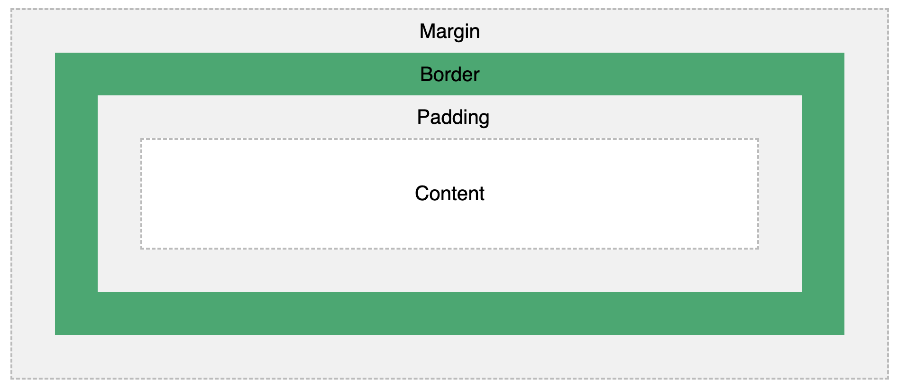

# CSS

Cascading Style Sheet

<!--
_class: lead
_paginate: skip
-->

---

# What is CSS?

- CSS stands for Cascading Style Sheets
- CSS describes how HTML elements are to be displayed on screen, paper, or in other media
- CSS can control the layout of multiple web pages all at once

---

# CSS Example

```css
body {
  background-color: lightblue;
}

h1 {
  color: white;
  text-align: center;
}

p {
  font-family: verdana;
  font-size: 20px;
}
```

---

# CSS Syntax

<style scoped>
p, ul > li {
  font-size: 0.8rem;
}
</style>

A CSS rule consists of a selector and a declaration block.


- The selector points to the HTML element you want to style.
- The declaration block contains one or more declarations separated by semicolons.
- Each declaration includes a CSS property name and a value, separated by a colon.
- Multiple CSS declarations are separated with semicolons, and declaration blocks are surrounded by curly braces.

---

# CSS Syntax Example

```css
p {
  color: red;
  text-align: center;
}
```

- `p` is a selector in CSS (it points to the HTML element you want to style: `<p>`).
- `color` is a property, and `red` is the property value
- `text-align` is a property, and `center` is the property value

---

# CSS Selectors

CSS selectors are used to "find" (or select) the HTML elements you want to style.

- Element Selector
- ID Selector
- Class Selector
- Universal Selector
- Grouping Selector

---

# CSS Element Selector

The element selector selects HTML elements based on the element name.

```html
<p>Hello World</p>
```

```css
p {
  text-align: center;
  color: red;
}
```

---

# CSS ID Selector

The id selector uses the id attribute of an HTML element to select a specific element.

```html
<p id="para1">Hello World</p>
```

```css
#para1 {
  text-align: center;
  color: red;
}
```

---

# CSS Class Selector

The class selector selects HTML elements with a specific class attribute.

```html
<p class="">Hello World</p>
```

```css
.center {
  text-align: center;
  color: red;
}
```

---

# CSS Universal Selector

The universal selector (\*) selects all HTML elements on the page.

```css
* {
  text-align: center;
  color: blue;
}
```

---

# CSS Grouping Selector

The grouping selector selects all the HTML elements with the same style definitions.

```css
h1,
h2,
p {
  text-align: center;
  color: red;
}
```

---

# CSS Selector Summary

<style scoped>
  tr > td {
    font-size: 0.88rem;
  }
</style>

| Selector           | Example    | description                                         |
| ------------------ | ---------- | --------------------------------------------------- |
| #id                | #firstname | Selects the element with id="firstname"             |
| .class             | .intro     | Selects all elements with class="intro"             |
| element.class      | p.intro    | Selects only `<p>` elements with class="intro"      |
| \*                 | \*         | Selects all elements                                |
| element            | p          | Selects all `<p>` elements                          |
| element,element,.. | div, p     | Selects all `<div>` elements and all `<p>` elements |

---

# How to Insert CSS

There are three ways of inserting a style sheet:

1. External CSS
2. Internal CSS
3. Inline CSS

---

# External CSS

<style scoped>
  p, pre {
    font-size: 0.8rem;
  }
</style>

With an external style sheet, you can change the look of an entire website by changing just one file!

```html
...
<head>
  <link rel="stylesheet" href="mystyle.css" />
</head>
...
```

_mystyle.css_

```css
body {
  background-color: lightblue;
}
```

---

# Internal CSS

An internal style sheet may be used if one single HTML page has a unique style.

```html
...
<head>
  <style>
    body {
      background-color: linen;
    }
  </style>
</head>
...
```

---

# Inline CSS

An inline style may be used to apply a unique style for a single element.

```html
<h1 style="color:blue;text-align:center;">This is a heading</h1>
<p style="color:red;">This is a paragraph.</p>
```

---

# Multiple Style Sheets

<style scoped>
  p, pre { 
    font-size: 0.8rem;
  }
</style>

If some properties have been defined for the same selector (element) in different style sheets, the value from the last read style sheet will be used.

_mystyle.css_

```css
h1 {
  color: navy;
}
```

```html
<head>
  <link rel="stylesheet" type="text/css" href="mystyle.css" />
  <style>
    h1 {
      color: orange;
    }
  </style>
</head>
```

---

# Cascading Order

All the styles in a page will "cascade" into a new "virtual" style sheet by the following rules, where number one has the highest priority:

- Inline style (inside an HTML element)
- External and internal style sheets (in the head section)
- Browser default

So, an inline style has the highest priority, and will override external and internal styles and browser defaults.

---

# CSS Units

- CSS has several different units for expressing a length.
- Many CSS properties take "length" values, such as width, margin, padding, font-size, etc.

```css
h1 {
  font-size: 60px;
}

p {
  font-size: 25px;
  line-height: 50px;
}
```

---

# CSS Units - Absolute Length

The absolute length units are fixed and a length expressed in any of these will appear as exactly that size.

| Unit | Description                  |
| ---- | ---------------------------- |
| cm   | centimeters                  |
| mm   | millimeters                  |
| in   | inches (1in = 96px = 2.54cm) |
| px   | pixels (1px = 1/96th of 1in) |

---

# CSS Units - Relative Length

Relative length units specify a length relative to another length property. Relative length units scale better between different rendering mediums.

| Unit | Description                                                                               |
| ---- | ----------------------------------------------------------------------------------------- |
| em   | Relative to the font-size of the element (2em means 2 times the size of the current font) |
| rem  | Relative to font-size of the root element                                                 |
| %    | Relative to the parent element                                                            |

---

# CSS Combinators

A combinator is something that explains the relationship between the selectors.

- descendant selector (space)
- child selector (>)
- adjacent sibling selector (+)
- general sibling selector (~)

---

# Descendant Selector

The descendant selector matches all elements that are descendants of a specified element.

The following example selects all `<p>` elements inside `<div>` elements:

```css
div p {
  background-color: yellow;
}
```

---

# Child Selector (>)

The child selector selects all elements that are the children of a specified element.

The following example selects all `<p>` elements that are children of a `<div>` element:

```css
div > p {
  background-color: yellow;
}
```

---

# Adjacent Sibling Selector (+)

The adjacent sibling selector is used to select an element that is directly after another specific element.

The following example selects the first <p> element that are placed immediately after <div> elements:

```css
div + p {
  background-color: yellow;
}
```

---

# General Sibling Selector (~)

The general sibling selector selects all elements that are next siblings of a specified element.

```css
div ~ p {
  background-color: yellow;
}
```

---

# All CSS Combinator Selectors

<style scoped>
  td {
    font-size: 0.85rem;
  }
</style>

| Selector          | Example | description                                                                        |
| ----------------- | ------- | ---------------------------------------------------------------------------------- |
| element element   | div p   | Selects all `<p>` elements inside `<div>` elements                                 |
| element>element   | div > p | Selects all `<p>` elements where the parent is a `<div>` element                   |
| element+element   | div + p | Selects the first `<p>` element that are placed immediately after `<div>` elements |
| element1~element2 | p ~ ul  | Selects every `<ul>` element that are preceded by a `<p>` element                  |

---

# CSS Pseudo-classes

A pseudo-class is used to define a special state of an element.

For example, it can be used to:

- Style an element when a user mouses over it
- Style visited and unvisited links differently
- Style an element when it gets focus

---

# CSS Pseudo-class Syntax

The syntax of pseudo-classes:

```css
selector:pseudo-class {
  property: value;
}
```

---

# Anchor Pseudo-classes

<style scoped>
pre {
  font-size: 0.9rem;
}
</style>

```css
/* unvisited link */
a:link {
  color: #ff0000;
}
/* visited link */
a:visited {
  color: #00ff00;
}
/* mouse over link */
a:hover {
  color: #ff00ff;
}
/* selected link */
a:active {
  color: #0000ff;
}
```

---

# CSS Colors

Colors are specified using predefined color names, or RGB, HEX, HSL values.

```html
<h1 style="background-color:Tomato;">....</h1>
<h1 style="background-color:rgb(255, 99, 71);">...</h1>
<h1 style="background-color:#ff6347;">...</h1>
<h1 style="background-color:hsl(9, 100%, 64%);">...</h1>
```

---

# CSS Backgrounds

The CSS background properties are used to add background effects for elements.

- background-color
- background-image
- background-repeat
- background-attachment
- background-position

---

# CSS Backgrounds Shorthand

```css
body {
  background-color: #ffffff;
  background-image: url("img_tree.png");
  background-repeat: no-repeat;
  background-position: right top;
}
```

```css
body {
  background: #ffffff url("img_tree.png") no-repeat right top;
}
```

---

# CSS Box Model

The CSS box model is essentially a box that wraps around every HTML element. It consists of: content, padding, borders and margins.



---

# CSS Margins

The CSS margin properties are used to create space around elements, outside of any defined borders.

CSS has properties for specifying the margin for each side of an element:

- margin-top
- margin-right
- margin-bottom
- margin-left

---

# CSS Margins Shorthand

```css
p {
  /*  top margin is 25px, right margin is 50px, 
      bottom margin is 75px, left margin is 100px */
  margin: 25px 50px 75px 100px;
  /*  top margin is 25px, right and left margins are 50px, 
      bottom margin is 75px */
  margin: 25px 50px 75px;
  /*  top and bottom margins are 25px, right and left margins are 50px */
  margin: 25px 50px;
  /*  all four margins are 25px */
  margin: 25px;
}
```

---

# CSS Padding

The CSS padding properties are used to generate space around an element's content, inside of any defined borders.

CSS has properties for specifying the padding for each side of an element:

- padding-top
- padding-right
- padding-bottom
- padding-left

---

# CSS Padding Shorthand

```css
p {
  /*  top padding is 25px, right padding is 50px, 
      bottom padding is 75px, left padding is 100px */
  padding: 25px 50px 75px 100px;
  /*  top padding is 25px, right and left paddings are 50px, 
      bottom padding is 75px */
  padding: 25px 50px 75px;
  /*  top and bottom paddings are 25px, right and left paddings are 50px */
  padding: 25px 50px;
  /*  all four paddings are 25px */
  padding: 25px;
}
```

---

# CSS Height and Width

The CSS height and width properties are used to set the height and width of an element.

```css
div {
  height: 200px;
  width: 50%;
}
```

---

# CSS Borders

The CSS border properties allow you to specify the style, width, and color of an element's border.

- border-style
- border-width
- border-color
- border-radius

---

# CSS Borders Shorthand

The border property is a shorthand property for the following individual border properties:

- border-width
- border-style (required)
- border-color

```css
p {
  border: 5px solid red;
}
```

---

# CSS Text

CSS has a lot of properties for formatting text.

- color
- text-align
- text-decoration
- text-transform
- text-spacing
- text-shadow
