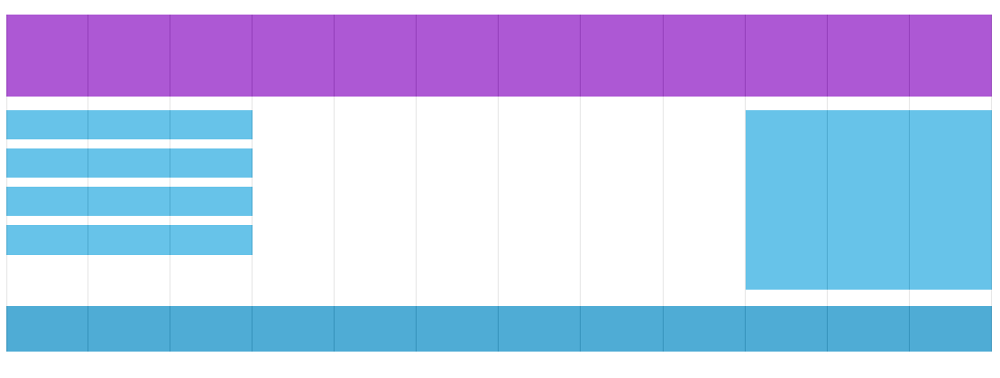

# Website Layout

CSS Website Layout

<!--
_class: lead
_paginate: skip
-->

---

# Website Layout

A website is often divided into headers, menus, content and a footer:


---

# Other Layout Content

The layout often depends on the target users. The most common layout is one (or combining them) of the following:


---

# Equal Columns


```css
/* Create three equal columns that float next to each other */
.column {
  float: left;
  width: 33.33%;
}
```


---

# Unequal Columns


---

# Unequal Columns CSS

```css
.column {
  float: left;
}

/* Left and right column */
.column.side {
  width: 25%;
}

/* Middle column */
.column.middle {
  width: 50%;
}
```


---

# Grid-View

Many web pages are based on a grid-view, which means that the page is divided into columns:


---

# Grid

Using a grid-view is very helpful when designing web pages. It makes it easier to place elements on the page



---

# CSS Box Sizing

<style scoped>
  pre {
    font-size: 0.9rem;
  }
</style>

The CSS box-sizing property allows us to include the padding and border in an element's total width and height.

```css
.div1 {
  width: 300px;
  height: 100px;
  border: 1px solid blue;
}

.div2 {
  width: 300px;
  height: 100px;
  border: 1px solid blue;
  box-sizing: border-box;
}
```


---
# Building a Responsive Grid-View

First ensure that all HTML elements have the box-sizing property set to border-box. This makes sure that the padding and border are included in the total width and height of the elements.

```css
* {
  box-sizing: border-box;
}
```
---

# Equal Grid Column

<style scoped>
  pre {
    font-size: 0.85rem;
  }
</style>

To have more control over the web page. First we must calculate the percentage for one column: 100% / 12 columns = 8.33%.

```css
.col-1 {width: 8.33%;}
.col-2 {width: 16.66%;}
.col-3 {width: 25%;}
.col-4 {width: 33.33%;}
.col-5 {width: 41.66%;}
.col-6 {width: 50%;}
.col-7 {width: 58.33%;}
.col-8 {width: 66.66%;}
.col-9 {width: 75%;}
.col-10 {width: 83.33%;}
.col-11 {width: 91.66%;}
.col-12 {width: 100%;}
```

---

# What is Responsive Web Design?

Responsive web design makes your web page look good on all devices.


---

# Setting Viewport
HTML5 introduced a method to let web designers take control over the viewport, through the <meta> tag.

```html
<meta name="viewport" content="width=device-width, initial-scale=1.0">
```

The width=device-width part sets the width of the page to follow the screen-width of the device (which will vary depending on the device).

The initial-scale=1.0 part sets the initial zoom level when the page is first loaded by the browser.

---

# Viewport Example Comparison


---

# What is a Media Query?

Media queries can be used to check many things, such as:
- width and height of the viewport
- orientation of the viewport (landscape or portrait)
- resolution

```css
@media not|only mediatype and (media feature) and (media feature) {
  CSS-Code;
}
```

---

# Media Query Example

```css
/* If the browser window is 600px or smaller, the background color will be lightblue: */
@media only screen and (max-width: 600px) {
  body {
    background-color: lightblue;
  }
}
```

---

# CSS Media Types

| Value  | Description                                           |
| ------ | ----------------------------------------------------- |
| all    | Used for all media type devices                       |
| print  | Used for print preview mode                           |
| screen | Used for computer screens, tablets, smart-phones etc. |

---

# CSS Media Features

| Value       | Description                                        |
| ----------- | -------------------------------------------------- |
| orientation | Orientation of the viewport. Landscape or portrait |
| max-height  | Maximum height of the viewport                     |
| min-height  | Minimum height of the viewport                     |
| height      | Height of the viewport (including scrollbar)       |
| max-width   | Maximum width of the viewport                      |
| min-width   | Minimum width of the viewport                      |
| width       | Width of the viewport (including scrollbar)        |

---

# Complete Media Query Example

<style scoped>
  pre{
    font-size: 0.6rem;
  }
</style>

When the screen (browser window) gets smaller than 768px, each column should have a width of 100%:

```css
/* For desktop: */
.col-1 {width: 8.33%;}
.col-2 {width: 16.66%;}
.col-3 {width: 25%;}
.col-4 {width: 33.33%;}
.col-5 {width: 41.66%;}
.col-6 {width: 50%;}
.col-7 {width: 58.33%;}
.col-8 {width: 66.66%;}
.col-9 {width: 75%;}
.col-10 {width: 83.33%;}
.col-11 {width: 91.66%;}
.col-12 {width: 100%;}

@media only screen and (max-width: 768px) {
  /* For mobile phones: */
  [class*="col-"] {
    width: 100%;
  }
}
```
---

# Typical Device Breakpoints

```css
/* Extra small devices (phones, 600px and down) */
@media only screen and (max-width: 600px) {...}

/* Small devices (portrait tablets and large phones, 600px and up) */
@media only screen and (min-width: 600px) {...}

/* Medium devices (landscape tablets, 768px and up) */
@media only screen and (min-width: 768px) {...}

/* Large devices (laptops/desktops, 992px and up) */
@media only screen and (min-width: 992px) {...}

/* Extra large devices (large laptops and desktops, 1200px and up) */
@media only screen and (min-width: 1200px) {...}

```
---

# Orientation: Portrait / Landscape

You can have a set of CSS properties that will only apply when the browser window is wider than its height, a so called "Landscape" orientation:

```css
@media only screen and (orientation: landscape) {
  body {
    background-color: lightblue;
  }
}
```

---

# CSS Flexbox

To start using the Flexbox model, you need to first define a flex container.

```css
.flex-container {
  display: flex;
}
```

---

# The `flex-direction` Property

The `flex-direction` property defines in which direction the container wants to stack the flex items.

```css
.flex-container {
  display: flex;
  flex-direction: column;
}
```

---

# The flex-wrap Property

The `flex-wrap` property specifies whether the flex items should wrap or not.

```css
.flex-container {
  display: flex;
  flex-wrap: wrap;
}
```
---

# The `justify-content` Property

The `justify-content` property is used to align the flex items:

```css
.flex-container {
  display: flex;
  justify-content: center;
}
```

---

# The `align-items` Property

The `align-items` property is used to align the flex items.

```css
.flex-container {
  display: flex;
  height: 200px;
  align-items: center;
}
```

---

# The `align-content` Property

The `align-content` property is used to align the flex lines.

```css
.flex-container {
  display: flex;
  height: 600px;
  flex-wrap: wrap;
  align-content: space-between;
}
```
---

# CSS Flex Responsive

```css
.flex-container {
  display: flex;
  flex-direction: row;
}

/* Responsive layout - makes a one column layout instead of a two-column layout */
@media (max-width: 800px) {
  .flex-container {
    flex-direction: column;
  }
}
```

---

# Assignments

- Buatlah sebuah halaman web sederhana yang menerapkan layout grid untuk mengatur tata letak konten. Halaman web tersebut harus memiliki header, sidebar, konten utama, dan footer.

- Buatlah sebuah halaman web CV responsif yang dapat menyesuaikan tampilannya dengan baik pada perangkat desktop, tablet, dan ponsel. Gunakan media queries untuk mengatur tampilan layout sesuai dengan ukuran layar.