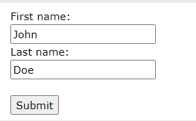

# HTML Forms


<!--
_class: lead
_paginate: skip
-->

---

# HTML Forms

An HTML form is used to collect user input. The user input is most often sent to a server for processing.



---

# The `<form>` Element

The HTML `<form>` element is used to create an HTML form for user input:

```html
<form>
.
form elements
.
</form>
```

---

# The Action Attribute

The action attribute defines the action to be performed when the form is submitted.

```html
<form action="/action_page.php">
  <label for="fname">First name:</label><br>
  <input type="text" id="fname" name="fname" value="John"><br>
  <label for="lname">Last name:</label><br>
  <input type="text" id="lname" name="lname" value="Doe"><br><br>
  <input type="submit" value="Submit">
</form>
```

---

# The Target Attribute

<style scoped>
  table {
    font-size: 0.8rem;
  }
</style>

The `target` attribute specifies where to display the response that is received after submitting the form.

| Value     | Description                                              |
| --------- | -------------------------------------------------------- |
| _blank    | The response is displayed in a new window or tab         |
| _self     | The response is displayed in the current window          |
| _parent   | The response is displayed in the parent frame            |
| _top      | The response is displayed in the full body of the window |
| framename | The response is displayed in a named iframe              |

---

# The Method Attribute

The `method` attribute specifies the HTTP method to be used when submitting the form data.

```html
<form action="/action_page.php" method="get">
```

```html
<form action="/action_page.php" method="post">
```

---

# GET Method

- Appends the form data to the URL, in name/value pairs
- NEVER use GET to send sensitive data! (the submitted form data is visible in the URL!)
- The length of a URL is limited (2048 characters)
- Useful for form submissions where a user wants to bookmark the result
- GET is good for non-secure data, like query strings in Google

---

# POST Method

- Appends the form data inside the body of the HTTP request (the submitted form data is not shown in the URL)
- POST has no size limitations, and can be used to send large amounts of data.
- Form submissions with POST cannot be bookmarked


---

# HTML Form Elements

<style scoped>
  table { 
    font-size: 0.7rem;
  }
</style>

| Tag          | Description                                            |
| ------------ | ------------------------------------------------------ |
| `<form>`     | Defines an HTML form for user input                    |
| `<input>`    | Defines an input control                               |
| `<textarea>` | Defines a multiline input control (text area)          |
| `<label>`    | Defines a label for an `<input>` element               |
| `<fieldset>` | Groups related elements in a form                      |
| `<legend>`   | Defines a caption for a `<fieldset>` element           |
| `<select>`   | Defines a drop-down list                               |
| `<optgroup>` | Defines a group of related options in a drop-down list |
| `<option>`   | Defines an option in a drop-down list                  |
| `<button>`   | Defines a clickable button                             |

---

# The `<input>` Element

<style scoped>
  table { 
    font-size: 0.8rem;
  }
</style>

An `<input>` element can be displayed in many ways, depending on the type attribute.

| Type                      | Description                                                      |
| ------------------------- | ---------------------------------------------------------------- |
| `<input type="text">`     | Displays a single-line text input field                          |
| `<input type="radio">`    | Displays a radio button (for selecting one of many choices)      |
| `<input type="checkbox">` | Displays a checkbox (for selecting zero or more of many choices) |
| `<input type="submit">`   | Displays a submit button (for submitting the form)               |
| `<input type="button">`   | Displays a clickable button                                      |

---

# Other HTML Input Elements

`<input type="color">`,`<input type="date">`,`<input type="datetime-local">`,`<input type="email">`,`<input type="file">`,`<input type="hidden">`,`<input type="image">`,`<input type="month">`,`<input type="number">`,`<input type="password">`,`<input type="range">`,`<input type="reset">`,`<input type="search">`,`<input type="submit">`,`<input type="tel">`,`<input type="time">`,`<input type="url">`,`<input type="week">`,

---

# CSS Attribute Selectors

The attribute selector is used to select elements with a specified attribute.

```css
a[target] {
  background-color: yellow;
}
```

---

# CSS [attribute="value"] Selector

The [attribute="value"] selector is used to select elements with a specified attribute and value.

The following example selects all <a> elements with a target="\_blank" attribute:

```css
a[target="_blank"] {
  background-color: yellow;
}
```

---

# CSS [attribute~="value"] Selector

The [attribute~="value"] selector is used to select elements with an attribute value containing a specified word.

The following example selects all elements with a title attribute that contains a space-separated list of words, one of which is "flower":

```css
[title~="flower"] {
  border: 5px solid yellow;
}
```

---

# CSS [attribute|="value"] Selector

The [attribute|="value"] selector is used to select elements with the specified attribute, whose value can be exactly the specified value, or the specified value followed by a hyphen (-).

Note: The value has to be a whole word, either alone, like class="top", or followed by a hyphen( - ), like class="top-text".

```css
[class|="top"] {
  background: yellow;
}
```

---

# CSS [attribute^="value"] Selector

The [attribute^="value"] selector is used to select elements with the specified attribute, whose value starts with the specified value.

The following example selects all elements with a class attribute value that starts with "top":

Note: The value does not have to be a whole word!

```css
[class^="top"] {
  background: yellow;
}
```

---

# CSS [attribute$="value"] Selector

The [attribute$="value"] selector is used to select elements whose attribute value ends with a specified value.

The following example selects all elements with a class attribute value that ends with "test":

Note: The value does not have to be a whole word!

```css
[class$="test"] {
  background: yellow;
}
```

---

# CSS [attribute*="value"] Selector

The [attribute*="value"] selector is used to select elements whose attribute value contains a specified value.

The following example selects all elements with a class attribute value that contains "te":

Note: The value does not have to be a whole word!

```css
[class*="te"] {
  background: yellow;
}
```

---

# Assignments

- Buatlah sebuah formulir pendaftaran untuk sebuah acara seminar. Formulir harus memiliki bidang untuk nama, email, nomor telepon, dan pilihan topik seminar yang diminati.
- Buatlah sebuah formulir pemesanan makanan online. Formulir harus memiliki bidang untuk memilih menu makanan, jumlah porsi, metode pembayaran, dan alamat pengiriman.
- Buatlah sebuah formulir survei kepuasan pelanggan. Formulir harus memiliki bidang untuk menilai berbagai aspek layanan, seperti kualitas produk, kecepatan pengiriman, dan pelayanan customer service.