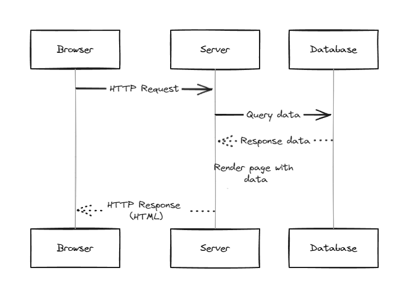
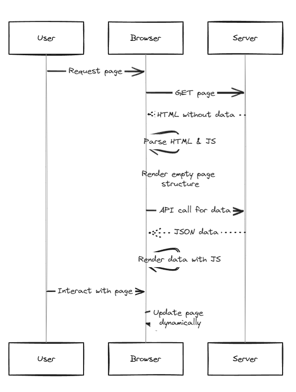
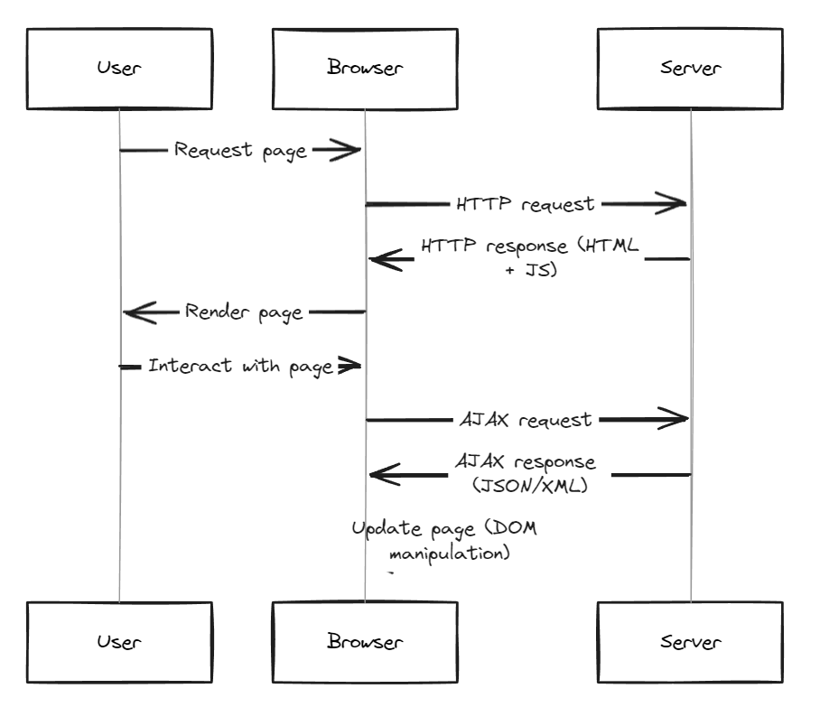

# AJAX

Asynchronous JavaScript And XML

<!--
_class: lead
_paginate: skip
-->

---

## Web Rendering Types

1. Server Side Rendering
2. Client Side Rendering

---

## Server Side Rendering



---

## Client Side Rendering




---

## What is AJAX

AJAX allows web pages to be updated asynchronously by exchanging data with a web server behind the scenes. This means that it is possible to update parts of a web page, without reloading the whole page.

---

## How AJAX Works



---

## The XMLHttpRequest Object

The XMLHttpRequest object can be used to exchange data with a web server behind the scenes. This means that it is possible to update parts of a web page, without reloading the whole page.

---

## Create an XMLHttpRequest Object

```js
variable = new XMLHttpRequest();
```
Example : 
```js
const xhttp = new XMLHttpRequest();
```

---

## Define a Callback Function

The callback function should contain the code to execute when the response is ready. 

```js
variable.onload = function() {
  // What to do when the response is ready
}
```
Example : 
```js
xhttp.onload = function() {
  document.getElementById("result").innerHTML = xhttp.responseText ;
}
```
---

## Send a Request

```js
variable.open(METHOD, url_resource);
variable.send();
```
Example : 
```js
xhttp.open("GET", "http://example.com/api");
xhttp.send();
```

---

## XMLHttpRequest Object Methods

|Method|	Description|
|---|---|
|new XMLHttpRequest()|	Creates a new XMLHttpRequest object|
|abort()|	Cancels the current request|
|getAllResponseHeaders()|	Returns header information|
|getResponseHeader()|	Returns specific header information|

---

|Method|	Description|
|---|---|
|open(method, url, async, user, psw)|	Specifies the request|
||`method`: the request type GET or POST|
||`url`: the file location|
||`async`: true (asynchronous) or false (synchronous)|
||`user`: optional user name|
||`psw`: optional password|

---

|Method|	Description|
|---|---|
|send()|	Sends the request to the server|
||Used for GET requests|
|send(string)|	Sends the request to the server.|
||Used for POST requests|
|setRequestHeader()|	Adds a label/value pair to the header to be sent|

---

## XMLHttpRequest Object Properties

|Property|	Description|
|---|---|
|onload|	Defines a function to be called when the request is received (loaded)|
|onreadystatechange|	Defines a function to be called when the readyState property changes|

---
|Property|	Description|
|---|---|
|readyState|	Holds the status of the XMLHttpRequest.|
||0: request not initialized|
||1: server connection established|
||2: request received|
||3: processing request|
||4: request finished and response is ready|
---
|Property|	Description|
|---|---|
|responseText|	Returns the response data as a string|
|responseXML|	Returns the response data as XML data|
|status|	Returns the status-number of a request|
||200: "OK"|
||403: "Forbidden"|
||404: "Not Found"|
||For a complete list go to the Http Messages Reference|
|statusText|	Returns the status-text (e.g. "OK" or "Not Found")|

--- 

## Assignments

1. Buatlah sebuah aplikasi web sederhana yang menampilkan daftar quotes dari sebuah toko online. Gunakan AJAX untuk memuat data quotes dari server tanpa harus me-reload seluruh halaman web.
2. Buatlah sebuah aplikasi web yang dapat menampilkan cuaca terkini dari suatu lokasi tertentu. Gunakan AJAX untuk mengambil data cuaca dari API penyedia data cuaca tanpa harus me-reload halaman web.