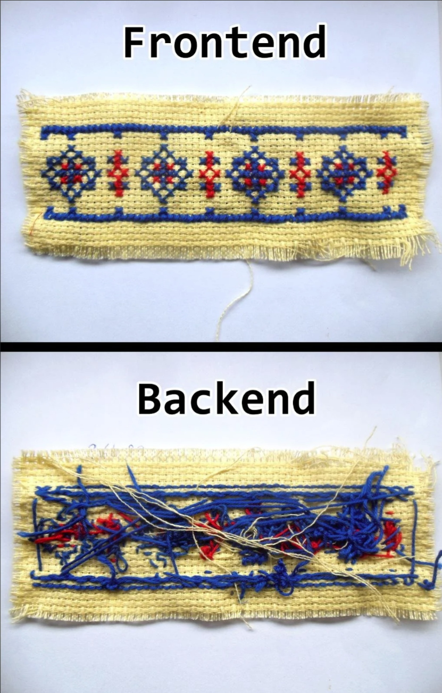

# Backend

<!--
_class: lead
_paginate: skip
-->

---

## Apa itu Backend

Backend adalah bagian dari aplikasi atau situs web yang menangani logika, database, autentikasi, dan pemrosesan data di sisi server.

---

## Backend vs Frontend



---

## Elemen pada Backend

- Server
- Database
- API (Application Programming Interface)
- Server-side Language
- Frameworks

---

## Server

Tempat aplikasi berjalan dan memproses permintaan dari klien (frontend).

---

## Database

 Tempat data disimpan, dikelola, dan diambil. Contoh database adalah MySQL, PostgreSQL, MongoDB, dan lainnya.

 ---

 ## APIs (Application Programming Interfaces)

 Antarmuka yang memungkinkan frontend dan backend berkomunikasi satu sama lain. API sering menggunakan protokol seperti HTTP/HTTPS.

 ---

 ## Server-Side Languages

 Bahasa pemrograman yang digunakan untuk menulis logika aplikasi di server. Contoh bahasa pemrograman ini termasuk JavaScript (dengan Node.js), Python, Ruby, PHP, dan Java.

 ---

 ## Frameworks

 Kerangka kerja yang membantu pengembangan aplikasi backend dengan menyediakan struktur dan alat yang dibutuhkan. Contohnya termasuk `Express.js` (untuk Node.js), `Django` (untuk Python), `Ruby` on `Rails` (untuk Ruby), dan `Laravel` (untuk PHP).

 ---

## API (Application Programming Interface)

API adalah singkatan dari Application Programming Interface. Ini adalah kumpulan aturan, protokol, dan alat yang memungkinkan berbagai perangkat lunak untuk berinteraksi satu sama lain.

---

## REST (Representational State Transfer)

REST adalah singkatan dari Representational State Transfer. Ini adalah gaya arsitektur perangkat lunak untuk pengembangan aplikasi web yang mendukung komunikasi antar sistem. 

---

## RESTful API

RESTfull API adalah API yang mengikuti prinsip-prinsip REST dalam desainnya. Ini berarti API tersebut menggunakan URL sebagai `endpoint`, menggunakan metode HTTP yang sesuai untuk memperbarui sumber daya (misalnya, `GET` untuk membaca, `POST` untuk membuat, `PUT` untuk memperbarui, `DELETE` untuk menghapus), dan mengembalikan data dalam format yang dapat dimengerti oleh mesin (biasanya JSON atau XML).

---

## Contoh RESTful API `products`

- `/products` untuk mendapatkan daftar produk
- `/products/:id` untuk mendapatkan detail produk dengan ID tertentu
- `/products` (POST) untuk membuat produk baru
- `/products/:id` (PUT) untuk memperbarui produk yang ada
- `/products/:id` (DELETE) untuk menghapus produk. 

Setiap permintaan ke endpoint ini akan mengembalikan data produk dalam format JSON.

---

## Node.js

 Node.js adalah lingkungan runtime JavaScript yang berjalan di server, memungkinkan pengembang untuk menggunakan JavaScript untuk pemrograman sisi server. 

---

## Who and When 

Node.js di kembangkan oleh Ryan Dahl, seorang software engineer, dan di rilis pertama kali tanggal 27 Mei 2009.


---

 ## Built on V8 Engine

 Node.js dibangun di atas V8, mesin JavaScript open-source yang dikembangkan oleh Google.

---

## Asynchronous Programming

Pemrograman asinkron memungkinkan program untuk melakukan operasi yang memerlukan waktu lama tanpa menghentikan eksekusi kode lainnya. 

---

## NPM (Node Package Manager)
 
 Node.js dilengkapi dengan NPM, yang merupakan manajer paket terbesar di dunia untuk pustaka dan modul JavaScript. NPM memudahkan pengelolaan dependensi dan instalasi paket untuk aplikasi Node.js.

 ---

 ## Built-in Modules

`fs`,`http`,`https`,`path`,`os`,`events`,`stream`,`util`,`url`,`crypto`,`buffer`,`child_process`,`net`,`querystring`,`readline`,`zlib`

---

## Include Modules

To include a module, use the require() function with the name of the module:

```js
var http = require('http');
```

```js
http.createServer(function (req, res) {
  res.writeHead(200, {'Content-Type': 'text/html'});
  res.end('Hello World!');
}).listen(8080);
```

---

## Import `http`

```js
const http = require("http");

// The `http` module is a core module in Node.js 
// that allows Node.js to transfer data over 
// the Hyper Text Transfer Protocol (HTTP).
```


--- 

## Create Server

```js
const server = http.createServer((req, res) => {
  // statement
})

// The `http.createServer()` method is a built-in method 
// of the http module and it creates a new HTTP server and returns it.
```


---

## Listen

```js
server.listen(3001, () => {
    console.log("Server is listening on port 3001");
});
// The listen method is used to start the server 
// and make it listen for incoming connections.
```


--- 

## Get Pathname

```js
// parsing the URL of the incoming request 
//and storing the resulting URL object in the parsedUrl.
const parsedUrl = parse(req.url, true);
// The pathname property is a string that contains the path section of the URL,
parsedUrl.pathname
```


---

## Get Method

```js
req.method
// This property is used to determine the HTTP method of the request
```

---

## Get Query

```js
parsedUrl.query
// The query property of the parsedUrl object 
// represents the query string portion of the URL, 
```

---

## Set Header

```js
//  indicating that the server will send data in JSON format
res.setHeader("Content-Type", "application/json");
// means that any domain can fetch the data from this server 
// (this is a setting related to Cross-Origin Resource Sharing, or CORS).
res.setHeader("Access-Control-Allow-Origin", "*");
res.writeHead(200);
```

