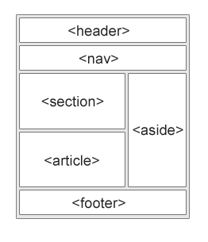
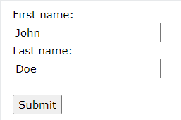

# HTML

<!--
_class: lead
_paginate: skip
-->

---

# What is HTML?

- HTML stands for Hyper Text Markup Language
- HTML is the standard markup language for creating Web pages
- HTML describes the structure of a Web page
- HTML consists of a series of elements
- HTML elements tell the browser how to display the content
- HTML elements label pieces of content such as "this is a heading", "this is a paragraph", "this is a link", etc.

---

# A Simple HTML Document

```html
<!DOCTYPE html>
<html>
  <head>
    <title>Page Title</title>
  </head>
  <body>
    <h1>My First Heading</h1>
    <p>My first paragraph.</p>
  </body>
</html>
```

---

# HTML Editors

A simple text editor is all you need to learn HTML

---

# What is an HTML Element?

An HTML element is defined by a start tag, some content, and an end tag:

```html
<tagname> Content goes here... </tagname>
```

The HTML element is everything from the start tag to the end tag:

```html
<h1>My First Heading</h1>
<p>My first paragraph.</p>
```

---

# HTML History

<style scoped>
    table {
        font-size: 25px
    }
</style>

| Year | Version                             | Year | Version                                 |
| ---- | ----------------------------------- | ---- | --------------------------------------- |
| 1989 | Tim Berners-Lee invented www        | 2008 | WHATWG HTML5 First Public Draft         |
| 1991 | Tim Berners-Lee invented HTML       | 2012 | WHATWG HTML5 Living Standard            |
| 1993 | Dave Raggett drafted HTML+          | 2014 | W3C Recommendation: HTML5               |
| 1995 | HTML Working Group defined HTML 2.0 | 2016 | W3C Candidate Recommendation: HTML 5.1  |
| 1997 | W3C Recommendation: HTML 3.2        | 2017 | W3C Recommendation: HTML5.1 2nd Edition |
| 1999 | W3C Recommendation: HTML 4.01       | 2017 | W3C Recommendation: HTML5.2             |
| 2000 | W3C Recommendation: XHTML 1.0       |

---

# HTML Attributes

- All HTML elements can have attributes
- Attributes provide additional information about elements
- Attributes are always specified in the start tag
- Attributes usually come in name/value pairs like: name="value"

```html
<a href="https://www.w3schools.com">Visit W3Schools</a>


<p style="color:red;">This is a red paragraph.</p>
```

---

# HTML Headings

HTML headings are titles or subtitles that you want to display on a webpage.

```html
<h1>Heading 1</h1>
<h2>Heading 2</h2>
<h3>Heading 3</h3>
<h4>Heading 4</h4>
<h5>Heading 5</h5>
<h6>Heading 6</h6>
```

---

# HTML Paragraphs

A paragraph always starts on a new line, and is usually a block of text.

```html
<p>This is a paragraph.</p>
<p>
  This paragraph contains a lot of lines in the source code, but the browser
  ignores it.
</p>
```

---

# HTML Horizontal Rules

- The `<hr>` tag defines a thematic break in an HTML page, and is most often displayed as a horizontal rule.
- The `<hr>` element is used to separate content (or define a change) in an HTML page:

```html
<h1>This is heading 1</h1>
<p>This is some text.</p>
<hr />
<h2>This is heading 2</h2>
<p>This is some other text.</p>
<hr />
```

---

# HTML Line Breaks

- The HTML `<br>` element defines a line break.
- Use `<br>` if you want a line break (a new line) without starting a new paragraph:

```html
<p>This is<br />a paragraph<br />with line breaks.</p>
```

---

# HTML Text Formatting

HTML contains several elements for defining text with a special meaning.

- `<b>` - Bold text
- `<strong>` - Important text
- `<i>` - Italic text
- `<em>` - Emphasized text
- `<mark>` - Marked text
- `<small>` - Smaller text

---

# HTML Text Formatting

- `<del>` - Deleted text
- `<ins>` - Inserted text
- `<sub>` - Subscript text
- `<sup>` - Superscript text

---

# HTML Links

- HTML links are hyperlinks.
- You can click on a link and jump to another document.
- When you move the mouse over a link, the mouse arrow will turn into a little hand.

```html
<a href="url">link text</a>
```

---

# HTML Links - The target Attribute

- By default, the linked page will be displayed in the current browser window. To change this, you must specify another target for the link.
- The target attribute can have one of the following values:
  - `_self` - Default. Opens the document in the same window/tab as it was clicked
  - `_blank` - Opens the document in a new window or tab
  - `_parent` - Opens the document in the parent frame
  - `_top` - Opens the document in the full body of the window

---

# Absolute URLs vs. Relative URLs

```html
<h2>Absolute URLs</h2>
<p><a href="https://www.w3.org/">W3C</a></p>
<p><a href="https://www.google.com/">Google</a></p>

<h2>Relative URLs</h2>
<p><a href="html_images.asp">HTML Images</a></p>
<p><a href="/css/default.asp">CSS Tutorial</a></p>
```

---

# HTML Images

Images can improve the design and the appearance of a web page.

```html


```

---

# HTML Links - Use an Image as a Link

To use an image as a link, just put the  tag inside the <a> tag:

```html
<a href="default.asp">
  
</a>
```

---

# HTML Tables

<style scoped>
    code {
        font-size: 17px
    }
</style>

HTML tables allow web developers to arrange data into rows and columns.

```html
<table>
  <tr>
    <th>Company</th>
    <th>Contact</th>
  </tr>
  <tr>
    <td>Alfreds Futterkiste</td>
    <td>Maria Anders</td>
  </tr>
  <tr>
    <td>Centro comercial Moctezuma</td>
    <td>Francisco Chang</td>
  </tr>
</table>
```

---

# HTML Table Tags

| Tag          | Description                                                        |
| ------------ | ------------------------------------------------------------------ |
| `<table>`    | Defines a table                                                    |
| `<th>`       | efines a header cell in a table                                    |
| `<tr>`       | efines a row in a table                                            |
| `<td>`       | efines a cell in a table                                           |
| `<caption>`  | Defines a table caption                                            |
| `<colgroup>` | Specifies a group of one or more columns in a table for formatting |

---

# HTML Table Tags

| Tag       | Description                                                               |
| --------- | ------------------------------------------------------------------------- |
| `<col>`   | Specifies column properties for each column within a `<colgroup>` element |
| `<thead>` | Groups the header content in a table                                      |
| `<tbody>` | Groups the body content in a table                                        |
| `<tfoot>` | Groups the footer content in a table                                      |

---

# HTML Lists

<style scoped>
    code {
        font-size: 22px;    
    }
</style>

HTML lists allow web developers to group a set of related items in lists.

```html
<ul>
  <li>Coffee</li>
  <li>Tea</li>
  <li>Milk</li>
</ul>

<ol>
  <li>Coffee</li>
  <li>Tea</li>
  <li>Milk</li>
</ol>
```

---

# HTML Block and Inline Elements

- A block-level element always starts on a new line, and the browsers automatically add some space (a margin) before and after the element.
- An inline element does not start on a new line.

---

# Block-level Elements

`<address>`, `<article>`, `<aside>`, `<blockquote>`, `<canvas>`, `<dd>`, `<div>`, `<dl>`, `<dt>`, `<fieldset>`, `<figcaption>`, `<figure>`, `<footer>`, `<form>`, `<h1>`, -`<h6>`, `<header>`, `<hr>`, `<li>`, `<main>`, `<nav>`, `<noscript>`, `<ol>`, `<p>`, `<pre>`, `<section>`, `<table>`, `<tfoot>`, `<ul>`, `<video>`

---

# Inline Elements

`<a>`, `<abbr>`, `<acronym>`, `<b>`, `<bdo>`, `<big>`, `<br>`, `<button>`, `<cite>`, `<code>`, `<dfn>`, `<em>`, `<i>`, ``, `<input>`, `<kbd>`, `<label>`, `<map>`, `<object>`, `<output>`, `<q>`, `<samp>`, `<script>`, `<select>`, `<small>`, `<span>`, `<strong>`, `<sub>`, `<sup>`, `<textarea>`, `<time>`, `<tt>`, `<var>`

---

# The `<div>` Element

The `<div>` element is often used as a container for other HTML elements.

```html
<div>
  <h2>London</h2>
  <p>London is the capital city of England.</p>
  <p>London has over 13 million inhabitants.</p>
</div>
```

---

# HTML - The Head Element

- The `<head>` element is a container for metadata (data about data) and is placed between the `<html>` tag and the `<body>` tag.
- HTML metadata is data about the HTML document. Metadata is not displayed.
- Metadata typically define the document title, character set, styles, scripts, and other meta information.

---

# The Head Element

```html
<!DOCTYPE html>
<html>
  <head>
    <title>A Meaningful Page Title</title>
    <meta charset="UTF-8">
    <meta name="description" content="Free Web tutorials">
    <meta name="keywords" content="HTML, CSS, JavaScript">
    <meta name="author" content="John Doe">
    <meta name="viewport" content="width=device-width, initial-scale=1.0">
    <link rel="stylesheet" href="mystyle.css">
  <body>
    The content of the document......
  </body>
</html>
```

---

# HTML Semantic Elements

- A semantic element clearly describes its meaning to both the browser and the developer.
- Examples of non-semantic elements: `<div>` and `<span>` - Tells nothing about its content.
- Examples of semantic elements: `<form>`, `<table>`, and `<article>` - Clearly defines its content.

---

# Semantic Elements in HTML

<style scoped>
    p {
        font-size: 28px;
    }
</style>



Many web sites contain HTML code like: `<div id="nav">` `<div class="header">` `<div id="footer">` to indicate navigation, header, and footer.

In HTML there are some semantic elements that can be used to define different parts of a web page:  
`<article>`,`<aside>`,`<details>`,`<figcaption>`,`<figure>`,`<footer>`,`<header>`,`<main>`,`<mark>`,`<nav>`,`<section>`,`<summary>`,`<time>`

---

# HTML Forms



An HTML form is used to collect user input. The user input is most often sent to a server for processing.

---

# HTML Form Attributes

- The `action` attribute defines the action to be performed when the form is submitted.
- The `method` attribute specifies the HTTP method to be used when submitting the form data. The form-data can be sent as URL variables (with method="get") or as HTTP post transaction (with method="post").

---

# HTML Form Example

```html
<form action="/action_page.php" method="GET">
  <label for="fname">First name:</label><br />
  <input type="text" id="fname" name="fname" value="John" /><br />
  <label for="lname">Last name:</label><br />
  <input type="text" id="lname" name="lname" value="Doe" /><br /><br />
  <input type="submit" value="Submit" />
</form>
```

---

# HTML Form Elements

`<input>`, `<label>`, `<select>`, `<textarea>`, `<button>`, `<fieldset>`, `<legend>`, `<datalist>`, `<output>`, `<option>`, `<optgroup>`,

---

# HTML Input Types

`<input type="button">`, `<input type="checkbox">`, `<input type="color">`, `<input type="date">`, `<input type="datetime-local">`, `<input type="email">`, `<input type="file">`, `<input type="hidden">`, `<input type="image">`, `<input type="month">`, `<input type="number">`, `<input type="password">`, `<input type="radio">`, `<input type="range">`, `<input type="reset">`, `<input type="search">`, `<input type="submit">`, `<input type="tel">`, `<input type="text">`, `<input type="time">`, `<input type="url">`, `<input type="week">`

---

# Assignments

1. Buatlah halaman web sederhana yang berisi profil diri Anda menggunakan tag-tag HTML dasar seperti heading, paragraph, list, link, dan lainnya.
2. Buatlah halaman web yang berisi daftar menu makanan dari sebuah restoran. Gunakan tag-tag seperti heading, list, gambar, dan lainnya.
3. Buatlah halaman web yang menampilkan jadwal kuliah untuk satu mata kuliah. Gunakan tabel HTML untuk menampilkan jadwal tersebut.

---

# Quizzes

<!-- _class: lead -->

---

# Quiz #1

Apa yang harus dituliskan pada baris pertama suatu dokumen HTML?
a. `<html>`
b. `<!DOCTYPE html>`
c. `<head>`
d. `<title>`

---

# Quiz #2

Di manakah informasi meta tentang halaman HTML dituliskan?
a. `<body> `
b. `<header> `
c. `<head> `
d. `<title>`

---

# Quiz #3

Elemen HTML apa yang digunakan untuk membuat judul halaman web?
a. `<heading> `
b. `<title> `
c. `<h1> `
d. `<head>`

---

# Quiz #4

Bagaimana cara membuat paragraf text dalam HTML?
a. `<p> `
b. `<prg> `
c. `<paragraph> `
d. `<txt>`

---

# Quiz #5

Apa atribut yang digunakan pada elemen `<a>` untuk membuat tautan?
a. href
b. link
c. url
d. source

---

# Quiz #6

Elemen HTML apa yang digunakan untuk menampilkan gambar?
a. `<picture> `
b. `<image> `
c. ` `
d. `<photo>`

---

# Quiz #7

Apa nama elemen HTML untuk membuat baris pada tabel?
a. `<tr> `
b. `<th> `
c. `<td> `
d. `<row>`

---

# Quiz #8

Elemen HTML apa yang digunakan untuk membuat form input?
a. `<input> `
b. `<form> `
c. `<textarea> `
d. `<field>`

---

# Quiz #9

Apa atribut yang digunakan pada elemen `<input>` untuk membuat kotak input text?
a. text
b. inputbox
c. textfield
d. textarea

---

# Quiz #10

Di mana konten halaman HTML yang akan ditampilkan ke pengguna dituliskan?
a. `<header> `
b. `<body> `
c. `<footer> `
d. `<content>`

---

# END

<!-- _class: lead -->
